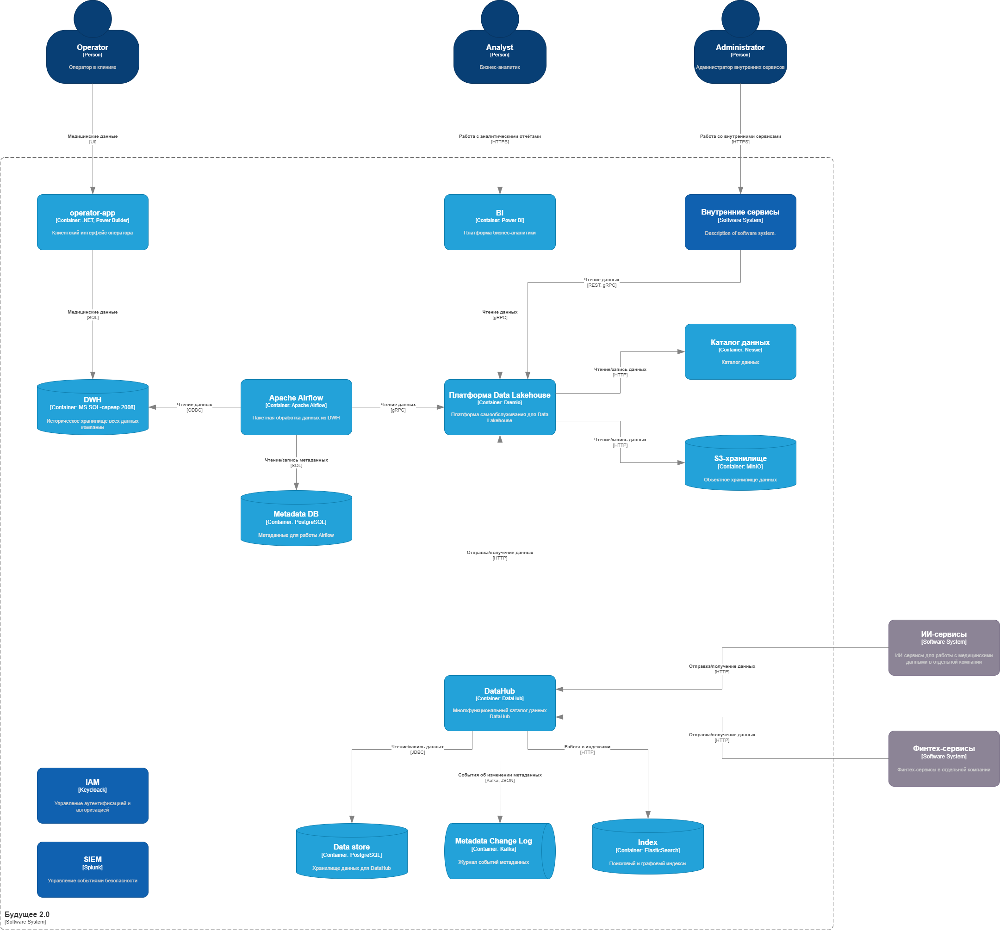

# Задание 1

## 1. Архитектура системы через год

## 2. Анализ проблемных мест

- Отсутствие возможности конструирования кастомных отчетов сотрудниками.

    <u>Описание:</u> Необходимость использования ограниченного набора доступных отчётов, либо добавления новых только через обращение к ответственному отделу существенно затрудняет аналитику и исключает возможность оперативного получения информации для принятия решений.

- Одно хранилище для всех данных под различные варианты использования.

    <u>Описание:</u> Для разных задач (аналитика, ИИ-сервисы) необходимы разные наборы и форматы данных. В случае одного общего хранилища это требует большого количества трансформаций, что в свою очередь замедляет time-to-market и приводит к снижению производительности.

- Реализация большого количества бизнес-логики на уровне СУБД.

    <u>Описание:</u> Расширение функционала текущей системы и интеграция с новыми системами будут требовать излишних расходов из-за необходимости дописывания и переписывания значительного количества бизнес-логики в DWH.
   
- Использование устаревшей технологии для DWH.

    <u>Описание:</u>  DWH реализован на базе Microsoft SQL-сервера 2008 года, который уже не поддерживается. Это создаёт дополнительные риски с точки зрения отказоустойчивости и безопасности данных, затрудняет горизонтальное масштабирование и отрицательно сказывается на производительности.

- Использование ограниченной технологии для интеграционной шины.

    <u>Описание:</u> Старая шина, реализованная на фреймворке Apache Camel, не способна обеспечить удобство и скорость интеграционных взаимодействий на уровне целевых технологий, таких как Apache Kafka, необходимые для обмена данными с новыми системами.

- Проблема безопасности данных.

    <u>Описание:</u> Вся информация, в т.ч. медицинские данные, хранятся в едином хранилище без тегирования, разграничения доступа к данным и аудита доступа, что может привести к утечке данных, штрафам и репутационным издержкам.

## 3. Приоритизация выявленных проблем (MoSCoW)

### Must have (обязательно исправить)

- Отсутствие возможности конструирования кастомных отчетов сотрудниками (прямой запрос от бизнеса).
- Одно хранилище для всех данных под различные варианты использования (добавление нового хранилища позволяет решить сразу эту и другие проблемы с наименьшим влиянием на существующую систему).

### Should have (желательно исправить)

- Использование ограниченной технологии для интеграционной шины (необходимо для интеграции с новыми системами).
- Проблема безопасности данных (нарушение законодательства, существенный риск для бизнеса).

### Could have (можно исправить)

- Реализация большого количества бизнес-логики на уровне СУБД (сложно отказаться от бизнес-логики старого хранилища, но возможно при постепенном переходе на новое хранилище).

### Won’t have (пока не нужно исправлять)

- Использование устаревшей технологии для DWH (проще развернуть новое хранилище с постепенным переносом в него данных и решаемых задач).