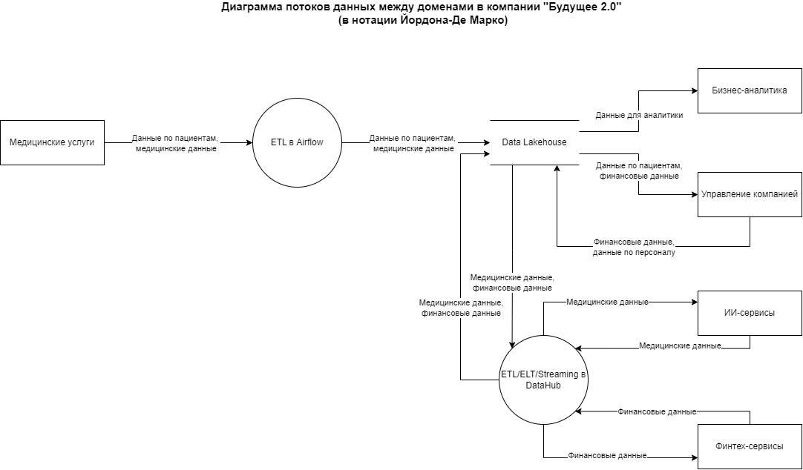

# Задание 2

## 1. Домены

- Домен **Медицинские услуги**
    - <u>Описание:</u> обеспечивает процессы оказания медицинских услуг пациентам, операционную деятельность клиник.
    - <u>Данные:</u> данные по пациентам, медицинские карты и истории болезни, в том числе — данные исследований, выполненных в ходе лечения.
    - <u>Сервисы:</u> клиентское приложение на Power Builder, DWH на базе MS SQL Server 2008.

- Домен **Бизнес-аналитика**
    - <u>Описание:</u> обеспечивает анализ данных, формирование аналитических отчетов для бизнеса.
    - <u>Данные:</u>: агрегированные данные для аналитики из других доменов.
    - <u>Сервисы:</u>: платформа аналитики Power BI, портал самообслуживания Dremio для Data Lakehouse.

- Домен **Управление компанией**
    - <u>Описание:</u> отвечает за решение административных задач, бухгалтерский, кадровый и складской учёт.
    - <u>Данные:</u>: внутренние финансовые данные, данные по персоналу клиник.
    - <u>Сервисы:</u>: различные внутренние сервисы, портал самообслуживания Dremio для Data Lakehouse.

- Домен **ИИ-сервисы**
    - <u>Описание:</u> отвечает за разработку и применение технологий ИИ для обработки медицинских данных.
    - <u>Данные:</u>: обезличенные медицинские данные.
    - <u>Сервисы:</u>: различные ИИ-сервисы на Python, каталог данных DataHub.

- Домен **Финтех-сервисы**
    - <u>Описание:</u> обеспечивает предоставление финансовых услуг и сервисов с использованием инновационных информационных технологий
    - <u>Данные:</u>: финансовые данные.
    - <u>Сервисы:</u>: различные финтех-сервисы на Golang и Java, каталог данных DataHub.

## 2. Потоки данных между доменами

## 3. Аргументация

Система разделена на домены в соответствии с решаемыми бизнес-задачами. Данное разделение согласуется с организационной структурой компании, общим принципом разделения ответственности за функционал и данные и даёт следующие преимущества:
- независимость развёртывания, масштабирования и функционирования сервисов в каждом домене, что повышает отказоустойчивость системы, сокращает time-to-market для нового функционала в каждом домене и упрощает интеграцию с новыми системами;
- соблюдение принципа Data Minimization, когда каждый домен отвечает за сбор, обработку и хранение только тех данных, которые ему необходимы, в соответствии с особенностями этих данных (например, во всех доменах кроме домена "Медицинские услуги" медицинские данные либо не нужны, либо используются в обезличенном виде), что снижает риски безопасности данных и нагрузку на сервисы хранения;
- возможность для бизнес-подразделений сосредоточиться на управлении своими собственными информационными продуктами, что позволяет улучшить качество данных и согласованность бизнеса.