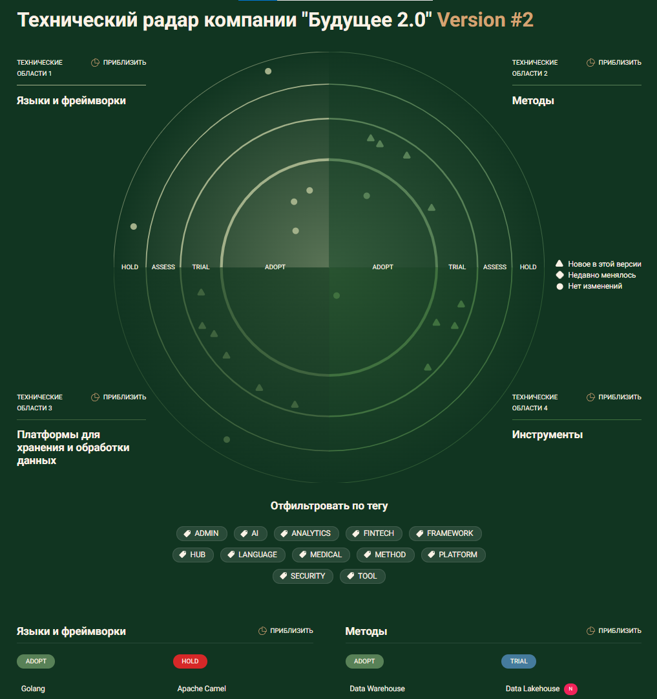
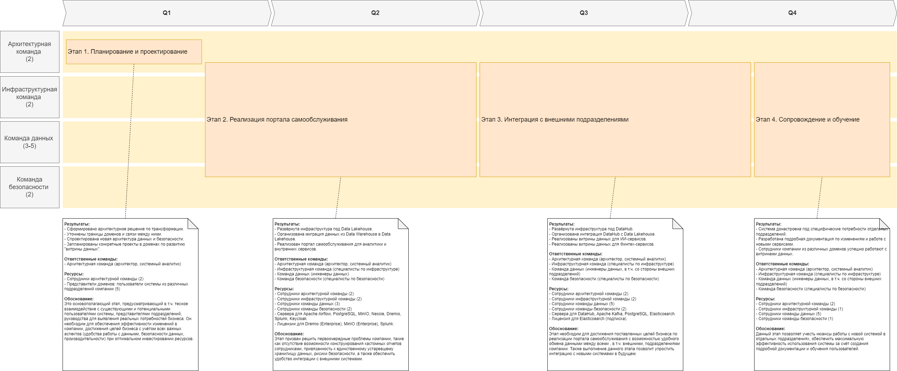

# Задание 3

## 1. Технический радар

Технология               | Квадрант                                  | Кольцо | Комментарий                                    |
------------------------ | ----------------------------------------- | ------ | ---------------------------------------------- |
Golang                   | Языки программирования и фреймворки       | adopt  | язык программирования                          |
Java                     | Языки программирования и фреймворки       | adopt  | язык программирования                          |
Python                   | Языки программирования и фреймворки       | adopt  | язык программирования                          |
Power Builder            | Языки программирования и фреймворки       | hold   | устаревший фреймворк для разработки приложений |
Apache Camel             | Языки программирования и фреймворки       | hold   | фреймворк для интеграции                       |
Data Warehouse           | Методы                                    | adopt  | архитектура хранения структурированных данных  |
Data Lakehouse           | Методы                                    | trial  | гибрид Data Lake и Data Warehouse              |
Data Mesh                | Методы                                    | trial  | распределённая архитектура данных              |
IAM                      | Методы                                    | trial  | управление идентификацией и контролем доступа  |
SIEM                     | Методы                                    | trial  | управление событиями безопасности              |
Power BI                 | Инструменты                               | adopt  | визуализация аналитических данных              |
Apache Airflow           | Инструменты                               | trial  | оркестрация пакетной обработки данных          |
Elasticsearch            | Инструменты                               | trial  | поисковый и графовый индекс                    |
Keycloak                 | Инструменты                               | trial  | инструмент аутентификациии и авторизации       |
Splunk                   | Инструменты                               | trial  | инструмент управления событиями безопасности   |
Microsoft SQLServer 2008 | Платформы для хранения и обработки данных | hold   | устаревшая СУБД, используемая для DWH          |
Apache Kafka             | Платформы для хранения и обработки данных | trial  | интеграция и потоковая обработка данных        |
DataHub                  | Платформы для хранения и обработки данных | trial  | многофункциональный каталог данных             |
Dremio                   | Платформы для хранения и обработки данных | trial  | платформа самообслуживания для Data Lakehouse  |
MinIO                    | Платформы для хранения и обработки данных | trial  | объектное хранилище данных                     |
Nessie                   | Платформы для хранения и обработки данных | trial  | каталог данных                                 |
PostgreSQL               | Платформы для хранения и обработки данных | trial  | реляционная СУБД                               |

## 2. Роадмап

### Этап 1. Планирование и проектирование (2 месяца)

**Результаты:**
- Сформировано архитектурное решение по трансформации. 
- Уточнены границы доменов и связи между ними. 
- Спроектирована новая архитектура данных и безопасности.
- Запланированы конкретные проекты в доменах по развитию «витрины данных».

**Ответственные команды:**
- Архитектурная команда (архитектор, системный аналитик)

**Ресурсы:**
- Сотрудники архитектурной команды (2)
- Представители доменов: пользователи системы из различных подразделений компании (5)

### Этап 2. Реализация портала самообслуживания (4 месяца)

**Результаты:**
- Развёрнута инфраструктура под Data Lakehouse.
- Организована миграция данных из Data Warehouse в Data Lakehouse.
- Реализован портал самообслуживания для аналитики и внутренних сервисов.

**Ответственные команды:**
- Архитектурная команда (архитектор, системный аналитик)
- Инфраструктурная команда (специалисты по инфраструктуре)
- Команда данных (инженеры данных)
- Команда безопасности (специалисты по безопасности)

**Ресурсы:**
- Сотрудники архитектурной команды (2)
- Сотрудники инфраструктурной команды (2)
- Сотрудники команды данных (3)
- Сотрудники команды безопасности (2)
- Сервера для Apache Airflow, PostgreSQL, MinIO, Nessie, Dremio, Splunk, Keycloak.
- Лицензии для Dremio (Enterprise), MinIO (Enterprise), Splunk.

### Этап 3. Интеграция с внешними подразделениями (4 месяца)

**Результаты:**
- Развёрнута инфраструктура под DataHub.
- Организована интеграция DataHub с Data Lakehouse.
- Реализованы витрины данных для ИИ-сервисов.
- Реализованы витрины данных для Финтех-сервисов.

**Ответственные команды:**
- Архитектурная команда (архитектор, системный аналитик)
- Инфраструктурная команда (специалисты по инфраструктуре)
- Команда данных (инженеры данных, в т.ч. со стороны внешних подразделений)
- Команда безопасности (специалисты по безопасности)

**Ресурсы:**
- Сотрудники архитектурной команды (2) 
- Сотрудники инфраструктурной команды (2) 
- Сотрудники команды данных (5)
- Сотрудники команды безопасности (2)
- Сервера для DataHub, Apache Kafka, PostgreSQL, Elasticsearch.
- Лицензия для Elasticsearch (подписка).

### Этап 4. Сопровождение и обучение (2 месяца)

**Результаты:**
- Система донастроена под специфические потребности отдельных подразделений.
- Разработана подробная документация по изменениям и работе с новыми сервисами.
- Сотрудники компании из различных доменов успешно работают с витринами данных.

**Ответственные команды:**
- Архитектурная команда (архитектор, системный аналитик)
- Инфраструктурная команда (специалисты по инфраструктуре)
- Команда данных (инженеры данных, в т.ч. со стороны внешних подразделений)
- Команда безопасности (специалисты по безопасности)

**Ресурсы:**
- Сотрудники архитектурной команды (2)
- Сотрудники инфраструктурной команды (1) 
- Сотрудники команды данных (5)
- Сотрудники команды безопасности (1)

## 3. Обоснование этапов роадмапа

### Этап 1. Планирование и проектирование
Это основополагающий этап, предусматривающий в т.ч. тесное взаимодействие с существующими и потенциальными пользователями системы, представителями подразделений, руководства для выявления реальных потребностей бизнеса. Он необходим для обеспечения эффективности изменений в компании, достижения целей бизнеса с учётом всех важных аспектов (удобства работы с данными, безопасности данных, производительности) при оптимальном инвестировании ресурсов.

### Этап 2. Реализация портала самообслуживания
Этап призван решить первоочередные проблемы компании, такие как отсутствие возможности конструирования кастомных отчетов сотрудниками, привязанность к единственному устаревшему хранилищу данных, рисики безопасности, а также обеспечить удобство интеграции с внешними системами.

### Этап 3. Интеграция с внешними подразделениям
Этап необходим для достижения поставленных целей бизнеса по реализации портала самообслуживания с возможностью удобного обмена данными между всеми , в т.ч. внешними, подразделениями компании. Также выполнение данного этапа позволит упростить интеграцию с новыми системами в будущем.

### Этап 4. Сопровождение и обучение
Данный этап позволяет учесть нюансы работы с новой системой в отдельных подразделениях, обеспечить максимальную эффективность использования системы за счёт создания подробной документации и обучения пользователей.
